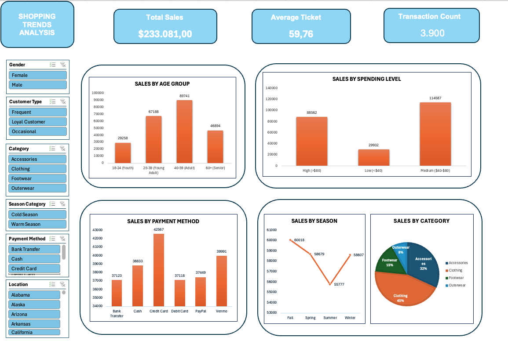

# 🏦 Proyecto de Dashboard en Excel. Shopping Trends Analysis 🚀

## 📝 1. Descripción del Proyecto

Este proyecto consiste en el desarrollo de un panel de control interactivo (**Dashboard**) en Microsoft Excel a partir del conjunto de datos **Shopping Trends** (https://www.kaggle.com/datasets/bhadramohit/customer-shopping-latest-trends-dataset). El objetivo principal es transformar los datos brutos de transacciones y clientes en métricas visuales y ejecutivas, facilitando la identificación de patrones de consumo, la segmentación demográfica por edad o género, y el comportamiento de compra para optimizar la toma de decisiones comerciales.

## 🗂 2. Estructura del Proyecto

A continuación, se detalla la organización de los archivos dentro de este repositorio para facilitar la navegación:

```text
├── shopping_trends.csv           # Dataset CSV original sin procesar.
├── shopping_trends_clean.xlsx    # Libro de Excel con el Dashboard interactivo y las tablas dinámicas.
├── imgDashboard                  # Captura de pantalla con la vista previa del dashboard.
└── README.md                     # Documentación y conclusiones del proyecto.
```

## 🛠 3. Instalación, Requisitos y Ejecución

**Requisitos Técnicos**

- **Software de Hoja de Cálculo:** Microsoft Excel (versión de escritorio para Windows o Mac) para visualizar y operar el libro de trabajo.
- **Componentes Activos:** Tablas Dinámicas, Gráficos Dinámicos y Segmentación de Datos (_Slicers_) interconectados mediante conexiones de informe.

**Pasos para la Ejecución y Uso**

- **1. Abrir el archivo:** Cargar el documento `shopping_trends_clean.xlsx` directamente en Microsoft Excel.
- **2. Navegar al panel:** Situarse en la hoja principal del Dashboard para visualizar las tarjetas de KPI y los gráficos ejecutivos.
- **3. Interactuar con los filtros:** Utilizar los segmentadores situados en la barra lateral izquierda (Género, Tipo de Cliente, Categoría, Estacionalidad, Método de Pago y Ubicación) para actualizar dinámicamente todo el panel de control al instante.

## 🧹 4. Transformación y Limpieza de los Datos

Antes de construir el panel ejecutivo, se procesó el conjunto de datos original (`shopping_trends.csv`) para garantizar la calidad, consistencia y facilidad de análisis en el libro de trabajo (`shopping_trends_clean.xlsx`):

- **Detección y Eliminación de Duplicados:** Revisión completa del dataset para identificar y limpiar registros repetidos, asegurando que cada transacción sea única y confiable.
- **Valores Nulos:** Comprobación y control de celdas vacías o campos incompletos en todo el conjunto de datos para evitar alteraciones en los cálculos globales.
- **Corrección de Tipos de Dato:** Ajuste de los formatos de datos (conversión de textos, números y campos monetarios al tipo correcto) para permitir un funcionamiento fluido de las tablas dinámicas.
- **Estandarización de Variables Categóricas:** Homogeneización de los nombres de categorías de productos, métodos de pago y ubicaciones.
- **Creación de Segmentaciones Lógicas:**
  - **Franjas de Edad (`Age Group`):** Agrupación de la edad en rangos estratégicos (_18-24 Youth_, _25-39 Young Adult_, _40-59 Adult_, y _60+ Senior_).
  - **Niveles de Gasto (`Spending Level`):** Clasificación de los importes en categorías (_Low <$40_, _Medium $40-$80_, y _High >$80_).
  - **Tipo de Cliente (`Customer Type`):** Segmentación y categorización de los perfiles de compra en tipologías específicas (_Frequent_, _Loyal Customer_ y _Occasional_) para el análisis del comportamiento de compra.
- **Validación de Métricas Clave:** Verificación de integridad en las 3.900 transacciones para asegurar la precisión matemática en el Total de Ventas ($233k USD) y el Ticket Medio ($59.76 USD).

## 📈 5. Análisis Descriptivo de los Datos

En este apartado se detalla la estructura del conjunto de datos, especificando la naturaleza de cada variable disponible en el dataset para comprender qué información alimenta el modelo antes de su análisis:

- **Métricas Cuantitativas (Numéricas):**
  - **Importe de la Compra (_Purchase Amount (USD)_):** Variable numérica continua que registra el valor monetario de cada transacción individual.
  - **Edad del Cliente (_Age_):** Variable numérica discreta que indica la edad del comprador, permitiendo clasificarlo en rangos demográficos (_Age Group_).
  - **Valoración de Reseña (_Review Rating_):** Calificación numérica otorgada por el cliente sobre su experiencia de compra.
  - **Compras Previas (_Previous Purchases_):** Conteo numérico del historial de transacciones anteriores realizadas por el usuario.
  - **Número de Transacciones (_Transaction Count_):** Conteo total de registros independientes que componen la muestra analizada ($3.900$ operaciones).

- **Variables Categóricas y Demográficas:**
  - **Género (_Gender_):** Variable categórica que clasifica al comprador.
  - **Ubicación (_Location_):** Estado o región geográfica donde se efectúa la operación comercial.
  - **Tipo de Cliente (_Customer Type_):** Define el nivel de fidelización o frecuencia de compra en la base de datos (ej. _Frequent_, _Loyal Customer_, _Occasional_).
  - **Frecuencia de Compras (_Frequency of Purchases_):** Patrón temporal con el que el usuario suele realizar sus adquisiciones (ej. _Weekly_, _Fortnightly_, _Annually_).

- **Variables de Producto y Características:**
  - **Artículo Comprado e Item (_Item Purchased_ / _Category_):** Especifica el producto exacto y la categoría principal a la que pertenece (ej. _Clothing_, _Accessories_, _Footwear_, _Outerwear_).
  - **Talla y Color (_Size_ / _Color_):** Atributos físicos específicos de la prenda adquirida.
  - **Estación y Categoría Estacional (_Season_ / _Season Category_):** Estación del año asociada a la compra (_Cold Season_ / _Warm Season_).

- **Variables de Gestión y Promoción:**
  - **Nivel de Gasto (_Spending Level_):** Segmentación categórica derivada del importe (Alto, Moderado, Bajo).
  - **Estado de Suscripción (_Subscription Status_):** Indica si el cliente cuenta con una suscripción activa (Sí/No).
  - **Método de Pago y Preferido (_Payment Method_ / _Preferred Payment Method_):** Vía de transacción financiera utilizada o preferida por el cliente (Tarjetas, PayPal, Venmo, Efectivo, etc.).
  - **Tipo de Envío (_Shipping Type_):** Modalidad logística seleccionada para la entrega (_Express_, _Free Shipping_, _Standard_, _Next Day Air_, etc.).
  - **Descuento Aplicado y Código Promocional (_Discount Applied_ / _Promo Code Used_):** Variables booleanas o categóricas que registran el uso de rebajas o códigos en la transacción.

## 📊 6. Informe Explicativo del Análisis (Conclusiones)

### 1. Métricas Globales (KPIs)

- **KPI de Ventas Totales (_Total Sales_ - $233.081,00):** Representa el volumen global de ingresos acumulados en las 3.900 transacciones del dataset, sirviendo como indicador principal para medir la escala financiera general del negocio.
- **KPI de Ticket Medio (_Average Ticket_ - $59,76):** Mide el valor monetario promedio de cada operación individual, permitiendo evaluar la rentabilidad por transacción y el comportamiento de gasto de los clientes.
- **KPI de Volumen de Transacciones (_Transaction Count_ - 3.900 operaciones):** Refleja la cantidad total de actos de compra registrados en la muestra, aportando el contexto del tamaño del mercado analizado para garantizar la fiabilidad del análisis.

### 2. Interpretación y Justificación de los Gráficos del Dashboard

- **Gráfico de Ventas por Grupo de Edad (`Sales by Age Group`):** Muestra que el núcleo principal de compradores se concentra en la franja de adultos de **40-59 años** ($89.741) y adultos jóvenes (**25-39 años** con $67.188), lo cual es vital destacar porque evidencia dónde reside el mayor retorno económico y permite enfocar con precisión los esfuerzos publicitarios sin desperdiciar presupuesto.
- **Gráfico de Ventas por Nivel de Gasto (`Sales by Spending Level`):** Refleja un claro predominio del nivel moderado (`Medium $40-$80`) con $114.587 frente a los niveles alto y bajo, lo que se resalta para demostrar que la salud financiera del negocio depende de un consumidor constante de ticket medio y no de picos aislados.
- **Gráfico de Ventas por Método de Pago (`Sales by Payment Method`):** Presenta una distribución variada donde destaca el uso de la tarjeta de crédito (`Credit Card`) con $42.567 y Venmo con $39.991, resultando fundamental incluirlo para conocer las preferencias de pago de los usuarios y garantizar pasarelas optimizadas.
- **Gráfico de Ventas por Estación (`Sales by Season`):** Muestra un comportamiento bastante parejo con un ligero repunte en otoño (_Fall_ - $60.018) y un descenso en verano (_Summer_ - $55.777), ayudando a justificar la planificación estacional de campañas.
- **Gráfico de Ventas por Categoría (`Sales by Category`):** Revela mediante un gráfico circular el claro liderazgo de la ropa (_Clothing_ con un **45%**) y los accesorios (_Accessories_ con un **32%**), cuyo objetivo es planificar mejor el inventario para tener siempre disponible lo que el cliente realmente demanda y optimizar la logística de stock.

### 3. Estructura e Interactividad del Dashboard

- **Organización Visual y Componentes:** El panel interactivo está diseñado de forma estructurada para ofrecer una lectura limpia y directa de los datos clave, contando con una sección superior dedicada a los KPIs globales (_Total Sales_, _Average Ticket_, _Transaction Count_) y una disposición en cuadrícula para los gráficos dinámicos.
- **Uso de Segmentadores (_Slicers_):** Se han integrado múltiples segmentadores laterales en la parte izquierda (filtrando por _Gender_, _Customer Type_, _Category_, _Season Category_, _Payment Method_ y _Location_), dotando al dashboard de total flexibilidad para auditar y filtrar toda la información en tiempo real con un solo clic.

---

📷 **Vista Previa del Dashboard**

## 

### 3. Recomendaciones de Negocio

- **Campañas por Rango de Edad:** Enfocar la publicidad digital en los grupos de 25 a 59 años, utilizando mensajes adaptados a sus hábitos de consumo y capacidad adquisitiva para maximizar el impacto comercial.
- **Estrategia de Fidelización y Pagos:** Dado que los métodos digitales y las tarjetas lideran las transacciones, es clave mantener integraciones fluidas con estas pasarelas y potenciar la retención de los compradores habituales.
- **Optimización del Ticket Medio y Stock:** Diseñar estrategias de venta cruzada (_cross-selling_) en las categorías principales (_Clothing_ y _Accessories_) para incentivar que los compradores asciendan de rango de gasto, asegurando además la correcta previsión de inventario para evitar roturas de stock.

## 🔄 7. Próximos Pasos

Para seguir desarrollando este proyecto, se proponen las siguientes mejoras sencillas:

- **Ampliación de KPIs:** Incorporar gráficos de evolución temporal por meses o días de la semana si se añade la variable de fecha en futuras versiones del dataset.
- **Análisis de Correlación:** Añadir matrices de correlación para evaluar la relación directa entre el método de pago utilizado y el importe total del ticket medio.
- **Segmentación Geográfica Detallada:** Profundizar en el análisis por estados o regiones para identificar patrones de consumo locales y optimizar las campañas de marketing geolocalizadas.

## 🤝 8. Contribuciones

Las sugerencias para mejorar este panel son bienvenidas. Si deseas proponer nuevas métricas, cambiar la disposición visual del dashboard o optimizar las fórmulas de las tablas dinámicas, abre un issue o envía tus comentarios.

## 👤 9. Autores

- **Zhaklina Dobromirova Karailieva** - [zhaklinaa](https://github.com/zhaklinaa)
- _Proyecto de Dashboard Interactivo y Análisis de Datos (Shopping Trends Analysis)._
